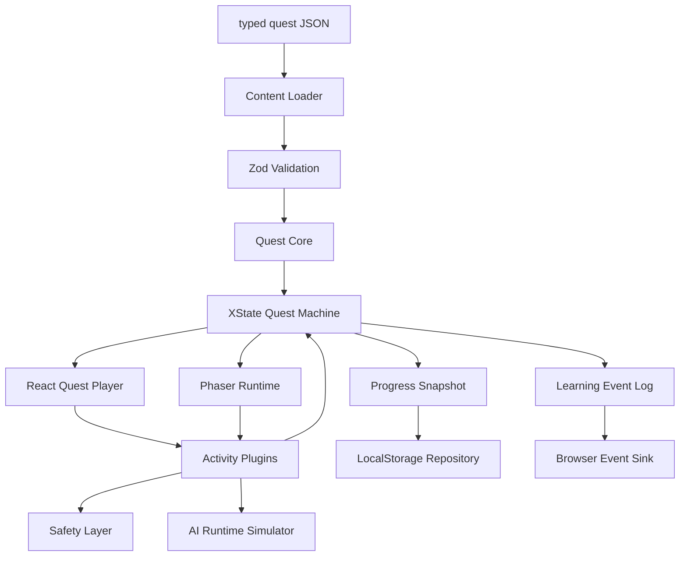

# 儿童心理健康教育 / SEL / 家校共育游戏化课程产品：AI 可执行工程架构规格文档

> 文档版本：v0.2  
> 日期：2026-06-01  
> 面向对象：AI 编程助手、前端工程师、全栈工程师、产品技术负责人  
> 建议项目代号：`sel-quest-platform`  
> 核心定位：一个可扩展的 Quest Runtime Platform，用于承载儿童心理健康教育、社会情绪学习（SEL）和家校共育的游戏化互动课程。

---

## 0. 给 AI 编程助手的阅读说明

你是一个工程实现助手。你需要基于本文档生成一个可维护、可扩展、可测试的 Web 产品代码框架。

在实现时，必须遵守以下原则：

1. **不要把课程内容硬编码在 React 组件或 Phaser 场景里。**
2. **不要让 Phaser 控制业务流程。** Phaser 只负责地图、动画、小游戏视觉表现。
3. **不要让 React 组件散落管理任务流程。** Quest 流程必须由状态机统一管理。
4. **不要在 MVP 阶段接入真实 LLM 自由聊天。** 第一阶段只实现规则反馈、模拟模型和结构化交互。
5. **不要做心理诊断、心理治疗、学生风险评分或“AI 心理咨询师”。** 产品定位是心理健康教育 / SEL / 家校共育互动课程。
6. **所有核心模块必须能被单元测试。** `quest-core` 不能依赖 React、Next.js、Phaser 或浏览器 API。
7. **内容、流程、表现、进度、AI、安全必须分层。**
8. **内容校验必须包含结构校验和语义校验。** Zod 负责字段形状，semantic validator 负责 ID 唯一性、引用完整性和流程可达性。
9. **不要把选择结果、学习信号或互动表现解释成心理能力、心理风险或人格画像。**
10. **任何面向儿童的公开版本都必须有儿童可理解的边界说明、监护人说明和隐私最小化策略。**

关键词约定：

- `MUST`：必须实现。
- `SHOULD`：强烈建议实现。
- `MAY`：可以后续实现。
- `MUST NOT`：禁止实现或禁止耦合。

### 0.1 v0.2 修订重点

本版本补齐以下工程和产品边界：

```text
严格 schema 与 semantic validation
Activity 类型一致性
内容包 canonical 格式
进度恢复 contract
用户可见 safety boundary
隐私、监护人同意与未成年人数据路线
可访问性与儿童体验基线
学习信号命名，避免心理评分误用
```

---

## 1. 产品定义

### 1.1 产品一句话

面向儿童的心理健康教育 / 社会情绪学习 / 家校共育游戏化课程平台，通过剧情任务、互动选择、情绪识别、情境练习和家长/教师指导，帮助儿童学习情绪表达、人际沟通、挫折应对和求助意识。

### 1.2 产品本质

本产品不是普通网页课程，也不是单纯小游戏，而是：

```text
教育内容 + Quest 流程 + 互动活动 + 游戏表现 + 学习进度 + 家校共育材料
```

### 1.3 首要工程目标

先搭建一个稳定的 Quest Runtime，而不是急着生产大量课程内容。

工程目标：

```text
内容是数据
流程是状态机
互动是插件
表现层可替换
进度是事件 + 快照
AI 是服务层，不是核心层
安全是跨层能力
```

### 1.4 目标用户

```text
Child Learner      儿童学习者，主要使用互动课程。
Guardian           家长/监护人，查看课程说明、家庭延伸建议和必要提醒。
Teacher            教师/心理老师，使用课程材料组织课堂或班会。
Content Author     内容作者，维护课程、对话、活动、教师指引。
Developer          工程开发者，扩展活动插件、运行时、数据存储和 AI 服务。
```

### 1.5 MVP 目标年龄

第一版建议聚焦：

```text
8-12 岁儿童
```

原因：

- 已具备基本阅读理解能力。
- 可以完成选择题、情绪卡片、简单情境判断。
- 适合进行结构化 SEL 训练。

### 1.6 MVP 课程主题建议

第一条 Quest 建议为：

```text
《情绪侦探：找回消失的心情颜色》
```

核心学习目标：

```text
识别常见情绪
理解情绪和行为之间的关系
学习合适表达情绪
学习向可信赖的大人求助
```

---

## 2. 产品边界

### 2.1 MVP 应该做什么

MVP MUST 实现：

```text
一个 Next.js Web 应用
一个 Quest JSON 内容包
一个 XState Quest 状态机
六个基础 Activity 插件
一个轻量 Phaser 地图/场景
localStorage 进度恢复
事件日志
开发调试面板
内容 schema 校验
内容 semantic validation
基础 safety schema
儿童可理解的产品边界说明
家长/教师 safety 说明
基础可访问性支持
```

MVP SHOULD 实现：

```text
家长可读课程摘要
教师可读课程说明
Quest 版本号
Activity 结果记录
刷新页面恢复当前 stage
减少动画模式
键盘可操作的 Activity
```

### 2.2 MVP 不应该做什么

MVP MUST NOT 实现：

```text
真实 LLM 自由聊天
AI 心理咨询师
心理测评诊断
儿童风险评分
班级心理风险排名
复杂教师后台
CMS
支付
多租户学校系统
真实用户登录
复杂权限系统
上传或同步儿童个人信息
收集儿童自由日记或家庭隐私细节
教师端个人心理画像
```

### 2.3 后续可以做什么

后续 MAY 实现：

```text
用户登录
数据库进度同步
教师端班级管理
家长端学习报告
内容 CMS
RAG + 已审核知识库
已备案大模型接口
微信小程序 / H5 容器适配
多课程、多年龄段、多语言
```

---

## 3. 技术栈

### 3.1 MVP 技术栈

```text
Package Manager: pnpm workspace
Language: TypeScript
Web Framework: Next.js App Router
UI: React
Game Runtime: Phaser 3
State Machine: XState
Schema Validation: Zod
Semantic Validation: custom pure TypeScript validators
Content: typed JSON / YAML
Persistence: localStorage
Testing: Vitest + React Testing Library
Lint/Format: ESLint + Prettier
Accessibility Baseline: semantic HTML + ARIA where needed + keyboard support
```

### 3.2 暂不接入的技术

MVP 阶段暂不接入：

```text
Supabase / Postgres
Headless CMS
真实 LLM
真实用户系统
复杂 BI/Analytics
Unity/Godot WebGL
```

### 3.3 后续技术演进

```text
阶段 1：localStorage + typed JSON
阶段 2：Postgres/MySQL + Auth + Event Log
阶段 3：自托管 CMS / Directus / Strapi
阶段 4：RAG / 私有化模型 / 已备案大模型
阶段 5：教师端、家长端、学校多租户
```

---

## 4. 架构总览

### 4.1 总体分层

```text
Content Layer
  typed JSON / YAML
  teacher guide
  guardian summary
  asset manifest

Quest Core Layer
  schema
  XState machine
  events
  progress snapshot
  versioning
  ports

Activity Layer
  activity schema
  React renderer
  optional Phaser interaction
  completion rule

Presentation Layer
  Next.js pages
  React UI
  Phaser scenes

Persistence Layer
  localStorage adapter
  future DB adapter

Safety Layer
  input guard
  output guard
  risk level
  crisis policy placeholder

AI Runtime Layer
  simulator first
  rule-based feedback
  future LLM/RAG adapter

Authoring Pipeline
  content-authoring ports
  content-validation reports
  review-core issue taxonomy
  content-refinement ports
  publishing gate
```

### 4.2 数据流

```text
Quest JSON
  ↓ validate by Zod
QuestDefinition
  ↓ createQuestMachine
Quest Actor
  ↓ state snapshot
React QuestPlayer + Phaser Runtime
  ↓ user interaction
Activity Result
  ↓ send event
Quest Machine
  ↓ update context
Progress Snapshot + Event Log
  ↓ persist
localStorage / future database
```

### 4.3 核心架构图



### 4.4 内容生产与发布流水线

受 QUEST-AI 的 `generate -> verify -> refine -> human review` 流程启发，儿童心理健康教育内容 MUST 区分运行时和生产侧。

```text
Expert-authored example / learning brief
  ↓
AI candidate generation
  ↓
Rule-based validation
  ↓
LLM ensemble validation
  ↓
AI-assisted refinement
  ↓
Expert review
  ↓
Publishing gate
  ↓
Quest Runtime
```

约束：

```text
AI MUST NOT directly publish child-facing content.
LLM validators are screening aids, not final authority.
Human expert approval is required before production publishing.
Published quests must have a matching validation report and matching expert reviews that satisfy the current review policy.
Blocking issues prevent publishing.
Required expert follow-ups prevent publishing.
Runtime packages must not depend on authoring implementation details.
```

第一版发布判定 SHOULD 使用以下证据：

```text
QuestDefinition.status === 'published'
ContentValidationReport.contentItemId === QuestDefinition.id
ContentValidationReport.contentVersion === QuestDefinition.version
ContentValidationReport.contentHash === hash(reviewable QuestDefinition content)
ContentValidationReport.status === 'passed'
ContentValidationReport.summary.safetyDecision === 'allow'
At least two matching ContentExpertReview records have decision 'approved'
Approved reviews come from at least two distinct reviewers
Approved reviews include school_mental_health_teacher and safety_reviewer roles
Approved reviews cover child_content, guardian_summary, teacher_guide, safety_policy, and activity_feedback
World, narrative, or asset-backed content additionally requires world_narrative and/or asset_representation coverage
Approved ContentExpertReview.contentHash === hash(reviewable QuestDefinition content)
No matching ContentExpertReview has required follow-ups
```

`contentHash` MUST be derived from reviewable child-facing content, not from lifecycle metadata. For example, changing `QuestDefinition.status` from `draft` to `published` MUST NOT change the hash; changing stages, activities, safety copy, guardian summary, or teacher guide MUST change it.
`contentHash` MUST use a strong canonical JSON hash such as SHA-256. Non-cryptographic or short hashes are not acceptable for binding validation and review evidence to content.

Validation and review evidence SHOULD be persisted beside the content package:

```text
quest.json
validation-report.json
expert-reviews.json
archived-expert-reviews.json
```

The runtime content loader MUST load and validate these artifacts. It MUST NOT silently generate fresh validation evidence during child-facing runtime loading, because generated-at-load evidence is not an auditable review record. Rule validators MAY be used by authoring tools or CI to create or refresh `validation-report.json`.

Public child-facing routes MUST use publishable content APIs only. Draft content MAY be available through development-only preview routes, but preview routes MUST NOT be treated as production runtime entry points.

Content evidence audit is separate from publishability:

```text
auditContentEvidence
  verifies quest/report/review ids, versions, and hashes are internally consistent
  flags published content that fails publishability
  does not fail draft content merely because expert review is still missing

isQuestPublishable
  requires published status, passed validation report, matching expert approvals satisfying policy, no follow-ups, and matching content hash
```

CI SHOULD run:

```text
npm run audit:content
npm run content:check-validation
```

These commands check persisted content evidence without requiring the full web smoke suite. `content:check-validation` is read-only: it reruns the deterministic validator using the persisted report id and timestamp, fails if `validation-report.json` is out of date, and also fails when the current report contains blocking issues.

Authoring tools SHOULD refresh rule-based validation reports with:

```text
npm run content:validate
```

This command reads `quest.json`, validates the quest schema and semantic links, runs the deterministic SEL validator, and rewrites adjacent `validation-report.json` files with matching content hashes. It is an authoring command, not a substitute for expert review. Test and CI fixtures MAY point it at another content root through `CONTENT_QUESTS_ROOT`.

Authoring state SHOULD be inspectable with:

```text
npm run content:status -- [quest-slug] [--json]
```

This command reads persisted content evidence and reports the derived authoring state, current content hash, validation status, expert review count, evidence issues, and publishability blockers. It MUST be read-only.

When validation or expert review requests changes, authoring tools SHOULD generate a revision packet:

```text
npm run content:revision-packet -- <quest-slug> [--out <path>]
```

This command verifies persisted evidence and emits validation issues, expert required follow-ups, current content hash, and refinement constraints. It MUST NOT edit quest content, approve content, or publish content. After revision, validation evidence MUST be regenerated and expert review MUST be repeated for the new content hash.

After content revision and validation regeneration, stale expert reviews SHOULD be archived with:

```text
npm run content:archive-stale-reviews -- <quest-slug> [--dry-run]
```

This command moves same-version expert reviews whose `contentHash` no longer matches the current quest into `archived-expert-reviews.json`, while keeping current-hash reviews in `expert-reviews.json`. It MUST reject mismatched content ids or versions rather than hiding bad evidence.

Expert reviewers SHOULD receive a generated review packet:

```text
npm run content:review-packet -- <quest-slug> [--out <path>]
```

This command validates the quest schema, verifies persisted evidence, and emits a packet containing the current content hash, validation summary, issue list, existing review summaries, reviewer checklist, and a `ContentExpertReview` template. The template MUST default to `changes_requested` with required follow-ups so it cannot be copied unchanged to bypass expert approval.

Completed expert reviews SHOULD be recorded through:

```text
npm run content:record-review -- <quest-slug> <review-json-path>
```

This command validates the submitted `ContentExpertReview`, rejects stale hashes, duplicate review ids, and unchanged template placeholders, then appends the review to `expert-reviews.json`. Recording a review MUST NOT publish content; publication remains a separate gate.

Publishing SHOULD go through the explicit content gate:

```text
npm run content:publish -- <quest-slug> [--dry-run]
```

This command validates the quest schema, verifies persisted validation and expert-review evidence, checks publishability against a `published` candidate, and only then writes `QuestDefinition.status = 'published'`. It MUST fail when expert approval is missing, stale, or has required follow-ups.

Authoring state SHOULD be derived from evidence rather than manually edited:

| State | Meaning |
|---|---|
| `drafting` | Quest exists but has no validation report yet. |
| `auto_validation_failed` | Validation evidence is missing/mismatched, or automated validation is blocked. |
| `needs_ai_refinement` | Automated validation found minor or major revision work. |
| `needs_expert_review` | Automated validation passed, but matching expert reviews do not yet satisfy the review policy. |
| `expert_changes_requested` | Expert review requested changes or required follow-ups. |
| `approved` | Validation passed and matching expert reviews satisfy the review policy, but quest is not published. |
| `published` | Validation passed, matching expert reviews satisfy the review policy, and quest status is `published`. |
| `archived` | Quest status is `archived`. |

---

## 5. Monorepo 目录结构

项目 MUST 使用 monorepo。

推荐目录：

```text
sel-quest-platform/
│
├─ apps/
│  └─ web/
│     ├─ app/
│     │  ├─ layout.tsx
│     │  ├─ page.tsx
│     │  ├─ quests/
│     │  │  ├─ page.tsx
│     │  │  └─ [questSlug]/
│     │  │     └─ page.tsx
│     │  └─ preview/
│     │     └─ [questSlug]/
│     │        └─ page.tsx
│     │
│     ├─ src/
│     │  ├─ features/
│     │  │  └─ quest-player/
│     │  │     ├─ QuestPlayer.tsx
│     │  │     ├─ QuestProvider.tsx
│     │  │     ├─ QuestStageView.tsx
│     │  │     ├─ ActivityHost.tsx
│     │  │     ├─ QuestProgressBar.tsx
│     │  │     ├─ QuestDebugPanel.tsx
│     │  │     └─ useQuestRuntime.ts
│     │  │
│     │  ├─ game/
│     │  │  ├─ PhaserCanvas.tsx
│     │  │  ├─ createGame.ts
│     │  │  └─ scenes/
│     │  │     ├─ BootScene.ts
│     │  │     ├─ QuestMapScene.ts
│     │  │     └─ ActivityScene.ts
│     │  │
│     │  ├─ registries/
│     │  │  ├─ activityRegistry.ts
│     │  │  └─ questRegistry.ts
│     │  │
│     │  └─ adapters/
│     │     ├─ localContentRepository.ts
│     │     ├─ localProgressRepository.ts
│     │     └─ browserEventSink.ts
│     │
│     ├─ next.config.ts
│     ├─ package.json
│     └─ tsconfig.json
│
├─ packages/
│  ├─ quest-core/
│  │  ├─ src/
│  │  │  ├─ schema/
│  │  │  ├─ validators/
│  │  │  ├─ machine/
│  │  │  ├─ events/
│  │  │  ├─ progress/
│  │  │  ├─ ports/
│  │  │  ├─ versioning/
│  │  │  └─ index.ts
│  │  └─ package.json
│  │
│  ├─ content/
│  │  ├─ src/
│  │  │  ├─ quests/
│  │  │  │  └─ emotion-detective/
│  │  │  │     ├─ quest.json
│  │  │  │     ├─ activities/
│  │  │  │     ├─ assets.json
│  │  │  │     ├─ teacher-guide.md
│  │  │  │     └─ guardian-summary.md
│  │  │  ├─ index.ts
│  │  │  └─ validateContent.ts
│  │  └─ package.json
│  │
│  ├─ activities/
│  │  ├─ src/
│  │  │  ├─ dialogue/
│  │  │  ├─ single-choice/
│  │  │  ├─ emotion-card/
│  │  │  ├─ scenario-choice/
│  │  │  ├─ breathing/
│  │  │  ├─ recap/
│  │  │  └─ index.ts
│  │  └─ package.json
│  │
│  ├─ game-runtime/
│  │  ├─ src/
│  │  │  ├─ GameBridge.ts
│  │  │  ├─ PhaserQuestRuntime.ts
│  │  │  ├─ scenes/
│  │  │  ├─ assets/
│  │  │  └─ index.ts
│  │  └─ package.json
│  │
│  ├─ ui/
│  │  ├─ src/
│  │  │  ├─ components/
│  │  │  └─ index.ts
│  │  └─ package.json
│  │
│  ├─ persistence/
│  │  ├─ src/
│  │  │  ├─ LocalStorageProgressRepository.ts
│  │  │  ├─ BrowserEventSink.ts
│  │  │  └─ index.ts
│  │  └─ package.json
│  │
│  ├─ safety/
│  │  ├─ src/
│  │  │  ├─ riskLevel.ts
│  │  │  ├─ inputGuard.ts
│  │  │  ├─ outputGuard.ts
│  │  │  ├─ crisisPolicy.ts
│  │  │  └─ index.ts
│  │  └─ package.json
│  │
│  └─ ai-runtime/
│     ├─ src/
│     │  ├─ ports/
│     │  ├─ simulators/
│     │  ├─ rules/
│     │  └─ index.ts
│     └─ package.json
│
├─ tooling/
│  ├─ eslint-config/
│  └─ tsconfig/
│
├─ pnpm-workspace.yaml
├─ package.json
├─ tsconfig.base.json
└─ README.md
```

---

## 6. Package 职责说明

| Package | 职责 | 禁止依赖 |
|---|---|---|
| `quest-core` | Quest schema、semantic validators、状态机、事件、进度快照、接口定义 | React、Next.js、Phaser、DOM、localStorage |
| `content` | 本地 typed JSON/YAML 内容、内容校验、内容导出 | 业务运行时、UI 组件 |
| `content-authoring` | AI/人工内容生成端口、候选 Quest provenance | 儿童运行时、UI 组件、直接模型实现 |
| `content-validation` | SEL 内容质量规则校验、发布前 validation report | React、Next.js、Phaser、DOM |
| `review-core` | 审核状态、issue taxonomy、validation report、专家审核记录、发布判断 | React、Next.js、Phaser、DOM |
| `content-refinement` | 根据 validation report 和 reviewer notes 生成修订端口 | 儿童运行时、UI 组件、直接模型实现 |
| `activities` | Activity schema、React renderer、完成规则 | Next.js router、数据库 |
| `game-runtime` | Phaser 封装、Scene、Bridge、资源加载 | Quest 内容硬编码、localStorage |
| `ui` | 通用 UI 组件 | Quest 业务流程、Phaser |
| `persistence` | localStorage / future DB adapter | React 组件状态 |
| `safety` | 风险分级、输入输出 guard、危机策略占位 | UI 表现细节 |
| `ai-runtime` | 模拟模型、规则反馈、未来 LLM/RAG adapter | Quest UI、Phaser |
| `apps/web` | Next.js 产品壳、页面、运行时组装 | 核心业务规则硬编码 |

---

## 7. `quest-core` 详细设计

`quest-core` 是整个项目最核心的纯 TypeScript 包。

### 7.1 `quest-core` 必须满足

```text
MUST be framework-agnostic
MUST be testable in Node.js
MUST expose schema and types
MUST expose semantic validators
MUST expose createQuestMachine
MUST expose progress snapshot helpers
MUST expose ports/interfaces
MUST NOT import React
MUST NOT import Phaser
MUST NOT access localStorage directly
MUST NOT call fetch directly unless through injected port
```

### 7.2 基础类型

```ts
export type AgeBand = '6-8' | '8-10' | '10-12' | '12-15'

export type QuestDomain =
  | 'sel'
  | 'mental_health_education'
  | 'family_school_collaboration'
  | 'ai_literacy'
  | 'general'

export type DataSensitivity =
  | 'none'
  | 'low'
  | 'child_personal'
  | 'psychological_sensitive'

export type QuestStatus = 'draft' | 'published' | 'archived'

export type SelCompetency =
  | 'self_awareness'
  | 'self_management'
  | 'social_awareness'
  | 'relationship_skills'
  | 'responsible_decision_making'

export interface SafeLearningDesign {
  sequenced: boolean
  active: boolean
  focused: boolean
  explicit: boolean
}

export interface LearningObjective {
  id: string
  title: string
  childFacingText: string
  selCompetencies: SelCompetency[]
  safe: SafeLearningDesign
}
```

### 7.3 QuestDefinition

```ts
export interface QuestDefinition {
  id: string
  slug: string
  version: string
  status: QuestStatus

  title: string
  subtitle?: string
  description: string

  domain: QuestDomain
  ageBand: AgeBand
  estimatedMinutes: number

  learningObjectives: LearningObjective[]

  safety: QuestSafetyDefinition
  guardianSummary: GuardianSummary
  teacherGuide?: TeacherGuide

  stages: QuestStageDefinition[]
  activities: ActivityDefinition[]
  assets: QuestAsset[]
}
```

### 7.4 QuestSafetyDefinition

```ts
export interface QuestSafetyDefinition {
  dataSensitivity: DataSensitivity
  allowsFreeTextInput: boolean
  requiresGuardianConsent: boolean
  crisisHandlingRequired: boolean
  minAge?: number
  maxAge?: number
}
```

### 7.5 GuardianSummary

```ts
export interface GuardianSummary {
  title: string
  description: string
  whatChildWillPractice: string[]
  whatDataIsCollected: string[]
  familyExtensionTips?: string[]
}
```

### 7.6 TeacherGuide

```ts
export interface TeacherGuide {
  objective: string
  suggestedDurationMinutes?: number
  discussionPrompts: string[]
  classroomTips: string[]
  riskNotes?: string[]
}
```

### 7.7 QuestStageDefinition

```ts
export type QuestStageType =
  | 'intro'
  | 'story'
  | 'activity'
  | 'reflection'
  | 'recap'
  | 'complete'

export interface QuestStageDefinition {
  id: string
  title: string
  type: QuestStageType

  activityId?: string
  unlockWhen?: UnlockRule

  onEnter?: QuestAction[]
  onComplete?: QuestAction[]

  next?: string
}
```

### 7.8 UnlockRule

```ts
export type UnlockRule =
  | { type: 'always' }
  | { type: 'stage_completed'; stageId: string }
  | { type: 'activity_completed'; activityId: string }
  | { type: 'all_stages_completed'; stageIds: string[] }
```

### 7.9 QuestAction

```ts
export type QuestAction =
  | { type: 'emit_event'; eventType: LearningEventType; payload?: Record<string, unknown> }
  | { type: 'set_flag'; key: string; value: boolean | string | number }
  | { type: 'show_notice'; noticeId: string }
```

### 7.10 ActivityDefinition

```ts
export type ActivityKind =
  | 'dialogue'
  | 'single-choice'
  | 'emotion-card'
  | 'scenario-choice'
  | 'breathing'
  | 'recap'

export interface ActivityDefinition<TConfig = unknown> {
  id: string
  kind: ActivityKind
  title?: string
  config: TConfig

  completion: ActivityCompletionRule

  safety?: ActivitySafetyDefinition
}
```

### 7.11 ActivityCompletionRule

```ts
export type ActivityCompletionRule =
  | { type: 'auto' }
  | { type: 'user_submit' }
  | { type: 'learning_signal_threshold'; minLearningSignal: number }
  | { type: 'time_elapsed'; minSeconds: number }
```

### 7.12 ActivitySafetyDefinition

```ts
export interface ActivitySafetyDefinition {
  allowsFreeTextInput?: boolean
  maxInputLength?: number
  blockedTopics?: string[]
  dataSensitivity?: DataSensitivity
}
```

### 7.13 ActivityResult

```ts
export interface ActivityResult<TValue = unknown> {
  activityId: string
  completed: boolean
  learningSignal?: number
  value?: TValue
  metadata?: Record<string, unknown>
}
```

### 7.14 QuestAsset

```ts
export type QuestAssetType = 'image' | 'audio' | 'spritesheet' | 'json' | 'video'

export interface QuestAsset {
  id: string
  type: QuestAssetType
  src: string
  alt?: string
  preload?: boolean
}
```

---

## 8. Zod Schema 校验

所有内容 MUST 通过 Zod schema 校验。

示例：

```ts
import { z } from 'zod'

export const QuestStatusSchema = z.enum(['draft', 'published', 'archived'])

export const AgeBandSchema = z.enum(['6-8', '8-10', '10-12', '12-15'])

export const DataSensitivitySchema = z.enum([
  'none',
  'low',
  'child_personal',
  'psychological_sensitive'
])

export const QuestSafetySchema = z.object({
  dataSensitivity: DataSensitivitySchema,
  allowsFreeTextInput: z.boolean(),
  requiresGuardianConsent: z.boolean(),
  crisisHandlingRequired: z.boolean(),
  minAge: z.number().int().optional(),
  maxAge: z.number().int().optional()
})

export const QuestStageSchema = z.object({
  id: z.string().min(1),
  title: z.string().min(1),
  type: z.enum(['intro', 'story', 'activity', 'reflection', 'recap', 'complete']),
  activityId: z.string().optional(),
  next: z.string().optional()
})

export const ActivityCompletionRuleSchema = z.discriminatedUnion('type', [
  z.object({ type: z.literal('auto') }),
  z.object({ type: z.literal('user_submit') }),
  z.object({
    type: z.literal('learning_signal_threshold'),
    minLearningSignal: z.number()
  }),
  z.object({
    type: z.literal('time_elapsed'),
    minSeconds: z.number().int().positive()
  })
])

export const ActivityDefinitionSchema = z.object({
  id: z.string().min(1),
  kind: z.enum([
    'dialogue',
    'single-choice',
    'emotion-card',
    'scenario-choice',
    'breathing',
    'recap'
  ]),
  title: z.string().optional(),
  learningObjectiveIds: z.array(z.string().min(1)).min(1),
  config: z.unknown(),
  completion: ActivityCompletionRuleSchema,
  safety: z
    .object({
      allowsFreeTextInput: z.boolean().optional(),
      maxInputLength: z.number().int().positive().optional(),
      blockedTopics: z.array(z.string()).optional(),
      dataSensitivity: DataSensitivitySchema.optional()
    })
    .optional()
})

export const SelCompetencySchema = z.enum([
  'self_awareness',
  'self_management',
  'social_awareness',
  'relationship_skills',
  'responsible_decision_making'
])

export const SafeLearningDesignSchema = z.object({
  sequenced: z.boolean(),
  active: z.boolean(),
  focused: z.boolean(),
  explicit: z.boolean()
})

export const LearningObjectiveSchema = z.object({
  id: z.string().min(1),
  title: z.string().min(1),
  childFacingText: z.string().min(1),
  selCompetencies: z.array(SelCompetencySchema).min(1),
  safe: SafeLearningDesignSchema
})

export const QuestDefinitionSchema = z.object({
  id: z.string().min(1),
  slug: z.string().min(1),
  version: z.string().min(1),
  status: QuestStatusSchema,
  title: z.string().min(1),
  subtitle: z.string().optional(),
  description: z.string().min(1),
  domain: z.enum([
    'sel',
    'mental_health_education',
    'family_school_collaboration',
    'ai_literacy',
    'general'
  ]),
  ageBand: AgeBandSchema,
  estimatedMinutes: z.number().int().positive(),
  learningObjectives: z.array(LearningObjectiveSchema).min(1),
  safety: QuestSafetySchema,
  guardianSummary: z.object({
    title: z.string().min(1),
    description: z.string().min(1),
    whatChildWillPractice: z.array(z.string()),
    whatDataIsCollected: z.array(z.string()),
    familyExtensionTips: z.array(z.string()).optional()
  }),
  teacherGuide: z
    .object({
      objective: z.string().min(1),
      suggestedDurationMinutes: z.number().int().positive().optional(),
      discussionPrompts: z.array(z.string()),
      classroomTips: z.array(z.string()),
      riskNotes: z.array(z.string()).optional()
    })
    .optional(),
  stages: z.array(QuestStageSchema).min(1),
  activities: z.array(ActivityDefinitionSchema).min(1),
  assets: z.array(z.unknown()).default([])
})

export function validateQuestDefinition(input: unknown): QuestDefinition {
  const quest = QuestDefinitionSchema.parse(input)
  const issues = validateQuestSemantics(quest)
  const errors = issues.filter((issue) => issue.severity === 'error')
  if (errors.length > 0) {
    throw new QuestValidationError(errors)
  }
  return quest
}
```

### 8.1 Semantic Validation

Zod 只负责字段结构。`quest-core` MUST 额外提供 semantic validator，用来检查跨字段约束和流程正确性。

MUST 校验：

```text
quest.id、quest.slug 合法且非空
stage.id 全局唯一
activity.id 全局唯一
stage.activityId 必须引用已有 activity
activity 类型必须在 ActivityKind 白名单内，并有对应 config schema
app/runtime 组装阶段必须额外校验 activity 类型有对应 renderer
除 complete stage 外，stage.next 必须引用已有 stage，或通过显式分支规则结束
complete stage 不应配置 next
从第一个 stage 出发，所有必需 stage 必须可达
不存在循环，除非 stage 显式声明 allowRepeat
activity.safety.allowsFreeTextInput 不得突破 quest.safety.allowsFreeTextInput
dataSensitivity 不得低于 activity 实际采集数据的敏感级别
```

示例接口：

```ts
export interface QuestValidationIssue {
  path: string
  code: string
  message: string
  severity: 'error' | 'warning'
}

export class QuestValidationError extends Error {
  constructor(public issues: QuestValidationIssue[]) {
    super('Quest semantic validation failed')
  }
}

export function validateQuestSemantics(
  quest: QuestDefinition
): QuestValidationIssue[] {
  // Pure TypeScript. No React, DOM, Phaser, localStorage or fetch.
}
```

`validateQuestDefinition` MUST 在 Zod parse 后执行 semantic validation。如果存在 `severity: 'error'` 的问题，必须抛错并阻止内容进入运行时。

---

## 9. Quest 状态机设计

### 9.1 QuestContext

```ts
export interface QuestContext {
  quest: QuestDefinition
  userId: string | 'anonymous'
  sessionId: string

  currentStageId?: string
  currentActivityId?: string

  completedStageIds: string[]
  completedActivityIds: string[]

  activityState: Record<string, unknown>
  flags: Record<string, boolean | string | number>

  startedAt?: string
  updatedAt?: string
  completedAt?: string

  lastError?: string
}
```

### 9.2 QuestEvent

```ts
export type QuestEvent =
  | { type: 'START' }
  | { type: 'RESUME'; snapshot: QuestProgressSnapshot }
  | { type: 'ENTER_STAGE'; stageId: string }
  | { type: 'ACTIVITY_STARTED'; activityId: string }
  | { type: 'ACTIVITY_PROGRESS'; activityId: string; value: unknown }
  | { type: 'ACTIVITY_COMPLETED'; activityId: string; result: ActivityResult }
  | { type: 'NEXT_STAGE' }
  | { type: 'RETRY_STAGE' }
  | { type: 'PAUSE' }
  | { type: 'RESET' }
  | { type: 'COMPLETE_QUEST' }
  | { type: 'ERROR'; message: string }
```

### 9.3 状态图

```text
idle
  START -> loading

loading
  content loaded -> ready
  error -> error

ready
  enter first stage -> playing.enteringStage

playing
  enteringStage
    -> runningActivity
    -> stageComplete if no activity

  runningActivity
    ACTIVITY_PROGRESS -> runningActivity
    ACTIVITY_COMPLETED -> evaluating

  evaluating
    completion ok -> stageComplete
    completion failed -> runningActivity

  stageComplete
    NEXT_STAGE -> enteringStage
    no next stage -> completed

paused
  RESUME -> playing

completed
  RESET -> idle

error
  RESET -> idle
```

### 9.4 createQuestMachine 合约

```ts
export interface CreateQuestMachineInput {
  quest: QuestDefinition
  userId?: string
  sessionId?: string
  initialSnapshot?: QuestProgressSnapshot | null
  now?: () => string
}

export function createQuestMachine(input: CreateQuestMachineInput) {
  // returns XState machine
}
```

### 9.5 状态机原则

状态机 MUST：

```text
决定当前 stage
决定当前 activity
决定 stage 是否完成
决定 quest 是否完成
生成 progress snapshot
发出 learning events
```

状态机 MUST NOT：

```text
直接写 localStorage
直接调用数据库
直接渲染 UI
直接访问 DOM
直接调用 Phaser Scene
```

---

## 10. Activity 插件模型

### 10.1 设计目标

新增互动类型时，只新增 Activity Plugin，不修改 QuestPlayer 主流程。

```text
新增课程 → 新增 JSON
新增互动形式 → 新增 activity plugin + registry
修改文案 → 修改内容文件
修改流程 → 修改 quest stages
```

### 10.2 ActivityRendererProps

```ts
export interface ActivityRendererProps<TConfig = unknown, TValue = unknown> {
  activity: ActivityDefinition<TConfig>
  value: TValue | undefined
  disabled?: boolean
  onChange: (value: TValue) => void
  onComplete: (result: ActivityResult<TValue>) => void
}

export type ActivityRenderer<TConfig = unknown, TValue = unknown> =
  React.ComponentType<ActivityRendererProps<TConfig, TValue>>
```

### 10.3 Activity Registry

```ts
import type { ZodType } from 'zod'

export interface ActivityPlugin<TConfig = unknown, TValue = unknown> {
  kind: ActivityKind
  configSchema: ZodType<TConfig>
  Renderer: ActivityRenderer<TConfig, TValue>
  getInitialValue?: (activity: ActivityDefinition<TConfig>) => TValue | undefined
}

export const activityRegistry: Record<ActivityKind, ActivityPlugin<any, any>> = {
  dialogue: {
    kind: 'dialogue',
    configSchema: DialogueActivityConfigSchema,
    Renderer: DialogueActivity
  },
  'single-choice': {
    kind: 'single-choice',
    configSchema: SingleChoiceActivityConfigSchema,
    Renderer: SingleChoiceActivity
  },
  'emotion-card': {
    kind: 'emotion-card',
    configSchema: EmotionCardActivityConfigSchema,
    Renderer: EmotionCardActivity
  },
  'scenario-choice': {
    kind: 'scenario-choice',
    configSchema: ScenarioChoiceActivityConfigSchema,
    Renderer: ScenarioChoiceActivity
  },
  breathing: {
    kind: 'breathing',
    configSchema: BreathingActivityConfigSchema,
    Renderer: BreathingActivity
  },
  recap: {
    kind: 'recap',
    configSchema: RecapActivityConfigSchema,
    Renderer: RecapActivity
  }
}
```

运行时 MUST 在渲染 Activity 前用对应 `configSchema` 校验 `activity.config`。校验失败时，不应渲染半坏 UI，应进入可恢复错误态并在 Debug Panel 显示问题。

### 10.4 MVP Activity 类型

MVP MUST 实现以下 6 个 Activity：

```text
1. dialogue
2. single-choice
3. emotion-card
4. scenario-choice
5. breathing
6. recap
```

---

## 11. Activity 配置定义

### 11.1 DialogueActivity

```ts
export interface DialogueActivityConfig {
  lines: Array<{
    speakerId: string
    speakerName: string
    avatarAssetId?: string
    text: string
  }>
  advanceMode: 'click' | 'auto'
}
```

行为：

```text
显示多轮对话
用户点击继续
最后一行结束后 onComplete
```

### 11.2 SingleChoiceActivity

```ts
export interface SingleChoiceActivityConfig {
  prompt: string
  options: Array<{
    id: string
    label: string
    feedback?: string
    learningSignal?: number
  }>
  submitLabel?: string
}
```

行为：

```text
用户选择一个选项
点击提交
返回 selectedOptionId
可返回 learningSignal
```

### 11.3 EmotionCardActivity

```ts
export interface EmotionCardActivityConfig {
  prompt: string
  emotions: Array<{
    id: string
    label: string
    emoji?: string
    description?: string
  }>
  acceptableEmotionIds?: string[]
  correctEmotionIds?: string[] // legacy alias; validators prefer acceptableEmotionIds
  feedbackByEmotionId?: Record<string, string>
}
```

行为：

```text
用户选择一种或多种情绪
系统显示反馈
onComplete 返回 selectedEmotionIds
```

### 11.4 ScenarioChoiceActivity

```ts
export interface ScenarioChoiceActivityConfig {
  scenarioText: string
  choices: Array<{
    id: string
    label: string
    outcomeText: string
    recommended?: boolean
    learningSignal?: number
  }>
}
```

行为：

```text
展示一个儿童常见情境
用户选择一种应对方式
展示对应后果
返回 selectedChoiceId + learningSignal
```

### 11.5 BreathingActivity

```ts
export interface BreathingActivityConfig {
  instruction: string
  inhaleSeconds: number
  holdSeconds?: number
  exhaleSeconds: number
  cycles: number
}
```

行为：

```text
显示呼吸节奏动画
完成指定 cycles 后自动完成
不采集心理自由文本
```

### 11.6 RecapActivity

```ts
export interface RecapActivityConfig {
  title: string
  summaryPoints: string[]
  childTakeaway: string
  guardianTip?: string
}
```

行为：

```text
显示本课总结
展示儿童可理解的 takeaway
可展示家长延伸建议
用户点击完成 Quest
```

### 11.7 Learning Signal 命名规则

SEL 产品中 MUST NOT 使用 `score`、`riskScore`、`emotionScore` 等容易被理解为心理评分的字段名。

MVP 统一使用：

```text
learningSignal
recommended
outcomeText
```

`learningSignal` 只能用于 activity 内部判断是否完成、是否展示某类教育反馈、是否推荐重试。它 MUST NOT 用于：

```text
儿童个人排名
心理风险判断
教师端标签
家长端能力评分
长期画像
跨课程聚合评分
```

---

## 12. React Quest Player 设计

### 12.1 组件层级

```text
QuestPlayer
  └─ QuestProvider
      └─ QuestLayout
          ├─ PhaserCanvas
          ├─ QuestStageView
          ├─ ActivityHost
          ├─ QuestProgressBar
          └─ QuestDebugPanel dev only
```

### 12.2 QuestPlayer

职责：

```text
加载 QuestDefinition
加载 progress snapshot
创建 QuestActor
组装 ProgressRepository 和 EventSink
提供 QuestProvider
```

伪代码：

```tsx
export function QuestPlayer({ questSlug }: { questSlug: string }) {
  const quest = useQuestDefinition(questSlug)
  const repositories = useQuestRepositories()

  if (!quest) return <QuestLoading />

  return (
    <QuestProvider quest={quest} repositories={repositories}>
      <QuestLayout>
        <PhaserCanvas />
        <QuestStageView />
        <ActivityHost />
        <QuestProgressBar />
        {process.env.NODE_ENV === 'development' && <QuestDebugPanel />}
      </QuestLayout>
    </QuestProvider>
  )
}
```

### 12.3 ActivityHost

职责：

```text
读取 currentActivity
根据 activity.kind 找 renderer
把 onChange/onComplete 转换为 QuestEvent
```

伪代码：

```tsx
export function ActivityHost() {
  const { currentActivity, activityValue, send } = useQuestRuntime()

  if (!currentActivity) return null

  const plugin = activityRegistry[currentActivity.kind]

  if (!plugin) {
    return <UnsupportedActivity kind={currentActivity.kind} />
  }

  const configResult = plugin.configSchema.safeParse(currentActivity.config)
  if (!configResult.success) {
    return <InvalidActivityConfig activityId={currentActivity.id} />
  }

  const Renderer = plugin.Renderer

  return (
    <Renderer
      activity={{ ...currentActivity, config: configResult.data }}
      value={activityValue}
      onChange={(value) => {
        send({
          type: 'ACTIVITY_PROGRESS',
          activityId: currentActivity.id,
          value
        })
      }}
      onComplete={(result) => {
        send({
          type: 'ACTIVITY_COMPLETED',
          activityId: currentActivity.id,
          result
        })
      }}
    />
  )
}
```

### 12.4 QuestDebugPanel

开发环境 MUST 实现 Debug Panel。

显示内容：

```text
questId
questVersion
sessionId
currentStageId
currentActivityId
runtime state
completedStageIds
completedActivityIds
activityState
last 20 learning events
localStorage snapshot preview
```

---

## 13. Phaser Runtime 设计

### 13.1 Phaser 的职责

Phaser 只负责：

```text
地图背景
角色移动
NPC
动画反馈
小游戏视觉层
资源加载
输入事件转发
```

Phaser MUST NOT：

```text
决定 quest 进入下一阶段
直接保存进度
直接读写 localStorage
直接路由跳转
硬编码心理课程内容
硬编码 stage 流程
```

### 13.2 GameBridge

React/XState 和 Phaser 之间通过 `GameBridge` 通信。

```ts
export interface GameBridgeToGameEvent {
  type: 'QUEST_STATE_CHANGED'
  state: QuestRuntimePublicState
}

export interface GameBridgeFromGameEvent {
  type: 'NPC_CLICKED' | 'MAP_NODE_CLICKED' | 'MINI_GAME_COMPLETED'
  payload?: Record<string, unknown>
}

export class GameBridge {
  sendToGame(event: GameBridgeToGameEvent): void
  sendToQuest(event: GameBridgeFromGameEvent): void
  onQuestEvent(listener: (event: GameBridgeFromGameEvent) => void): () => void
  onGameEvent(listener: (event: GameBridgeToGameEvent) => void): () => void
}
```

### 13.3 Phaser Scenes

MVP scenes：

```text
BootScene
  preload assets

QuestMapScene
  show simple map
  show child avatar / NPC
  highlight current stage node

ActivityScene
  optional mini-game canvas interaction
```

### 13.4 Phaser 与 Activity 的关系

大多数 Activity 用 React 实现。Phaser 只承载地图和轻量视觉反馈。

未来如果有 Phaser mini-game，它也必须通过 Activity Plugin 注册，并通过 `onComplete` 返回结果。

---

## 14. Progress 与 Event 设计

### 14.1 Progress Snapshot

```ts
export interface QuestProgressSnapshot {
  schemaVersion: 1

  userId: string | 'anonymous'
  questId: string
  questVersion: string

  status: 'not_started' | 'in_progress' | 'completed'

  runtimeState?: 'idle' | 'playing' | 'paused' | 'completed' | 'error'
  currentStageId?: string
  currentActivityId?: string

  completedStageIds: string[]
  completedActivityIds: string[]

  activityState: Record<string, unknown>
  flags: Record<string, boolean | string | number>

  startedAt: string
  updatedAt: string
  completedAt?: string

  lastEventId?: string
}
```

Progress Snapshot MUST persist domain state only. It MUST NOT persist raw XState internal snapshots, actor refs, functions, class instances, Phaser state, DOM state, timers or non-serializable values.

### 14.2 Learning Event

```ts
export type LearningEventType =
  | 'quest_started'
  | 'quest_resumed'
  | 'quest_resume_failed'
  | 'stage_entered'
  | 'activity_started'
  | 'activity_answered'
  | 'activity_completed'
  | 'stage_completed'
  | 'quest_completed'
  | 'quest_reset'
  | 'safety_notice_shown'

export interface LearningEvent {
  id: string
  type: LearningEventType

  questId: string
  questVersion: string
  stageId?: string
  activityId?: string

  userId: string | 'anonymous'
  sessionId: string

  payload?: Record<string, unknown>

  createdAt: string
}
```

### 14.3 Repository Ports

```ts
export interface LoadProgressInput {
  userId: string | 'anonymous'
  questId: string
  questVersion: string
}

export interface ResetProgressInput {
  userId: string | 'anonymous'
  questId: string
  questVersion: string
}

export interface ProgressRepository {
  loadProgress(input: LoadProgressInput): Promise<QuestProgressSnapshot | null>
  saveProgress(snapshot: QuestProgressSnapshot): Promise<void>
  resetProgress(input: ResetProgressInput): Promise<void>
}

export interface EventSink {
  append(event: LearningEvent): Promise<void>
  listRecent?(input: { sessionId: string; limit: number }): Promise<LearningEvent[]>
}
```

### 14.4 LocalStorage Key 设计

```text
quest_progress:{userId}:{questId}:{questVersion}
quest_events:{userId}:{questId}:{questVersion}:{sessionId}
```

示例：

```text
quest_progress:anonymous:emotion-detective:1.0.0
quest_events:anonymous:emotion-detective:1.0.0:session_abc123
```

### 14.5 Resume Contract

恢复进度时 MUST 按以下流程执行：

```text
1. load QuestDefinition
2. validateQuestDefinition，包括 semantic validation
3. load QuestProgressSnapshot by userId + questId + questVersion
4. 如果 snapshot 不存在，从 START 开始
5. 如果 snapshot.questVersion 不等于当前 quest.version，按版本策略处理
6. 使用 snapshot 中的 domain state 初始化 QuestContext
7. 重新创建 XState machine 和 actor
8. 由 machine 根据 currentStageId/currentActivityId 恢复 playing 状态
```

恢复时 MUST 校验：

```text
snapshot.currentStageId 仍存在
snapshot.currentActivityId 仍存在或可由 stage.activityId 推导
completedStageIds 中的每个 id 仍存在
completedActivityIds 中的每个 id 仍存在
activityState 只能包含当前 quest 中存在的 activityId
```

如果恢复失败，MUST：

```text
记录 quest_resume_failed event
向用户显示温和提示
允许用户重置进度
不要静默丢弃旧进度
```

---

## 15. 内容包设计

### 15.1 内容目录

MVP canonical 内容格式 MUST 使用单文件 `quest.json`，activities inline 在 `quest.json.activities` 中。

原因：

```text
减少内容加载和引用复杂度
方便一次性 Zod + semantic validation
降低初期编辑和测试成本
为后续 CMS normalized export 预留空间
```

目录中的 `activities/` 可作为后续大型内容或 CMS 导出格式，但 MVP 不应同时维护两套真源。

```text
packages/content/src/quests/emotion-detective/
  quest.json
  assets.json
  teacher-guide.md
  guardian-summary.md
```

未来 MAY 支持拆分格式：

```text
quest.meta.json
stages.json
activities/*.json
assets.json
```

但 loader 必须输出同一个 normalized `QuestDefinition`。

### 15.2 最小 Quest JSON 示例

```json
{
  "id": "emotion-detective",
  "slug": "emotion-detective",
  "version": "1.0.0",
  "status": "draft",
  "title": "情绪侦探",
  "subtitle": "找回消失的心情颜色",
  "description": "通过故事和选择练习识别情绪，并学习合适的表达方式。",
  "domain": "mental_health_education",
  "ageBand": "8-10",
  "estimatedMinutes": 12,
  "learningObjectives": [
    {
      "id": "lo_emotion_recognition",
      "title": "识别常见情绪",
      "childFacingText": "我能说出角色可能正在经历的心情。",
      "selCompetencies": ["self_awareness"],
      "safe": {
        "sequenced": true,
        "active": true,
        "focused": true,
        "explicit": true
      }
    },
    {
      "id": "lo_emotion_behavior_link",
      "title": "理解情绪和行为的关系",
      "childFacingText": "我能分辨心情和行为选择之间的关系。",
      "selCompetencies": ["self_awareness", "self_management"],
      "safe": {
        "sequenced": true,
        "active": true,
        "focused": true,
        "explicit": true
      }
    },
    {
      "id": "lo_help_seeking",
      "title": "学习在困难情境中寻求帮助",
      "childFacingText": "我能在困难情境中选择向可信赖的大人求助。",
      "selCompetencies": ["relationship_skills", "responsible_decision_making"],
      "safe": {
        "sequenced": true,
        "active": true,
        "focused": true,
        "explicit": true
      }
    }
  ],
  "safety": {
    "dataSensitivity": "low",
    "allowsFreeTextInput": false,
    "requiresGuardianConsent": false,
    "crisisHandlingRequired": false
  },
  "guardianSummary": {
    "title": "孩子将练习识别和表达情绪",
    "description": "本任务通过游戏化故事帮助孩子认识生气、难过、担心等常见情绪。",
    "whatChildWillPractice": [
      "选择合适的情绪卡片",
      "比较不同应对方式的结果",
      "学习向可信赖的大人求助"
    ],
    "whatDataIsCollected": [
      "任务完成进度",
      "选择题结果",
      "活动完成时间"
    ],
    "familyExtensionTips": [
      "和孩子一起说出今天经历过的一种情绪。",
      "鼓励孩子用“我感觉……因为……”表达感受。"
    ]
  },
  "teacherGuide": {
    "objective": "帮助学生识别常见情绪，并理解不同应对方式带来的结果。",
    "suggestedDurationMinutes": 15,
    "discussionPrompts": [
      "当你生气时，身体会有什么感觉？",
      "遇到误会时，可以先做什么？",
      "什么情况下应该找老师或家长帮忙？"
    ],
    "classroomTips": [
      "不要要求学生公开分享私人经历。",
      "鼓励学生讨论故事中的角色，而不是评价同学本人。"
    ],
    "riskNotes": [
      "如果学生主动表达严重痛苦或安全风险，应交由专业人员和监护人处理。"
    ]
  },
  "stages": [
    {
      "id": "intro",
      "title": "故事开始",
      "type": "story",
      "activityId": "dialogue_intro",
      "next": "choose_emotion"
    },
    {
      "id": "choose_emotion",
      "title": "他现在是什么心情？",
      "type": "activity",
      "activityId": "emotion_choice_001",
      "next": "scenario_choice"
    },
    {
      "id": "scenario_choice",
      "title": "我可以怎么做？",
      "type": "activity",
      "activityId": "scenario_choice_001",
      "next": "breathing"
    },
    {
      "id": "breathing",
      "title": "停一下，深呼吸",
      "type": "activity",
      "activityId": "breathing_001",
      "next": "recap"
    },
    {
      "id": "recap",
      "title": "任务总结",
      "type": "recap",
      "activityId": "recap_001",
      "next": "complete"
    },
    {
      "id": "complete",
      "title": "完成任务",
      "type": "complete"
    }
  ],
  "activities": [
    {
      "id": "dialogue_intro",
      "kind": "dialogue",
      "title": "故事开始",
      "learningObjectiveIds": ["lo_emotion_recognition"],
      "completion": { "type": "auto" },
      "safety": { "allowsFreeTextInput": false },
      "config": {
        "advanceMode": "click",
        "lines": [
          {
            "speakerId": "guide",
            "speakerName": "心情小侦探",
            "text": "欢迎来到心情颜色小镇。今天，有一个小朋友的心情颜色不见了。"
          },
          {
            "speakerId": "child_npc",
            "speakerName": "小宇",
            "text": "同学说我画得不好，我现在不想和任何人说话。"
          }
        ]
      }
    },
    {
      "id": "emotion_choice_001",
      "kind": "emotion-card",
      "title": "选择可能的心情",
      "learningObjectiveIds": ["lo_emotion_recognition"],
      "completion": { "type": "user_submit" },
      "safety": { "allowsFreeTextInput": false },
      "config": {
        "prompt": "你觉得小宇现在可能是什么心情？",
        "emotions": [
          { "id": "angry", "label": "生气", "emoji": "😠" },
          { "id": "sad", "label": "难过", "emoji": "😢" },
          { "id": "happy", "label": "开心", "emoji": "😊" },
          { "id": "worried", "label": "担心", "emoji": "😟" }
        ],
        "acceptableEmotionIds": ["angry", "sad"],
        "feedbackByEmotionId": {
          "angry": "是的，被别人否定时，有些人会感到生气。",
          "sad": "是的，被别人否定时，也可能会感到难过。"
        }
      }
    },
    {
      "id": "scenario_choice_001",
      "kind": "scenario-choice",
      "title": "选择一种应对方式",
      "learningObjectiveIds": [
        "lo_emotion_behavior_link",
        "lo_help_seeking"
      ],
      "completion": { "type": "user_submit" },
      "safety": { "allowsFreeTextInput": false },
      "config": {
        "scenarioText": "如果你是小宇，你可以怎么做？",
        "choices": [
          {
            "id": "push_classmate",
            "label": "推开同学，让他别说了",
            "outcomeText": "这样可能会让冲突变得更严重。生气时可以先停一下。",
            "learningSignal": 0
          },
          {
            "id": "say_feeling",
            "label": "说：你这样说让我很难过",
            "outcomeText": "这是更清楚表达感受的方式，也更容易让别人理解你。",
            "recommended": true,
            "learningSignal": 1
          },
          {
            "id": "ask_teacher",
            "label": "找老师帮忙说清楚",
            "outcomeText": "当自己不知道怎么处理时，找可信赖的大人帮忙是好办法。",
            "recommended": true,
            "learningSignal": 1
          }
        ]
      }
    },
    {
      "id": "breathing_001",
      "kind": "breathing",
      "title": "深呼吸练习",
      "learningObjectiveIds": ["lo_emotion_behavior_link"],
      "completion": { "type": "time_elapsed", "minSeconds": 30 },
      "safety": { "allowsFreeTextInput": false },
      "config": {
        "instruction": "跟着圆圈一起呼吸：吸气，停一下，慢慢呼气。",
        "inhaleSeconds": 4,
        "holdSeconds": 2,
        "exhaleSeconds": 4,
        "cycles": 3
      }
    },
    {
      "id": "recap_001",
      "kind": "recap",
      "title": "今天学到了什么？",
      "learningObjectiveIds": [
        "lo_emotion_recognition",
        "lo_emotion_behavior_link",
        "lo_help_seeking"
      ],
      "completion": { "type": "user_submit" },
      "safety": { "allowsFreeTextInput": false },
      "config": {
        "title": "情绪侦探任务完成",
        "summaryPoints": [
          "情绪没有对错，行为需要选择。",
          "生气或难过时，可以先停一下。",
          "可以用语言表达感受，也可以找可信赖的大人帮忙。"
        ],
        "childTakeaway": "下次遇到难受的事情时，我可以先说出自己的感受。",
        "guardianTip": "家长可以在日常生活中示范“我感觉……因为……”的表达方式。"
      }
    }
  ],
  "assets": []
}
```

---

## 16. Safety 层设计

### 16.1 Safety 的定位

Safety 层是跨模块能力，用来约束输入、输出、数据敏感性和危机场景处理。

MVP 即使不开放自由输入，也 MUST 预留 safety schema。

### 16.2 RiskLevel

```ts
export type SafetyRiskLevel =
  | 'none'
  | 'mild'
  | 'needs_adult_attention'
  | 'crisis'
```

### 16.3 SafetyCheckResult

```ts
export interface SafetyCheckResult {
  allowed: boolean
  riskLevel: SafetyRiskLevel
  reason?: string
  recommendedAction?:
    | 'continue'
    | 'show_support_message'
    | 'notify_guardian'
    | 'stop_activity'
}
```

### 16.4 InputGuard

```ts
export interface InputGuard {
  check(input: {
    text?: string
    activityId?: string
    questId?: string
    ageBand?: AgeBand
  }): Promise<SafetyCheckResult>
}
```

### 16.5 MVP Safety 策略

MVP MUST：

```text
默认不允许儿童自由输入长文本
只记录结构化选择结果
不生成心理诊断结论
不输出“你有抑郁/焦虑”等判断
不输出学生心理风险标签
不向教师展示个人心理画像
```

MVP SHOULD：

```text
所有 activity 显式标注 allowsFreeTextInput
所有 quest 显式标注 dataSensitivity
Debug Panel 中显示 safety 配置
```

### 16.6 未来危机场景占位

未来如果开放自由输入，必须加入危机处理策略。

关键词场景包括但不限于：

```text
自伤
自杀
伤害他人
被霸凌
被虐待
性侵害
严重家庭暴力
```

MVP 不实现自动危机干预，但接口必须预留。

### 16.7 用户可见边界说明

MVP MUST 在儿童入口、家长摘要或教师说明中展示清晰边界：

```text
这是情绪学习和沟通练习产品
这不是心理诊断、心理治疗或紧急求助服务
如果你或身边的人正处于危险中，应立即联系可信赖的大人或当地紧急服务
如果你在美国并遇到自杀或情绪危机，可拨打或短信联系 988
```

儿童端文案必须简短、温和、可理解，不应制造恐惧感。

示例：

```text
这个任务会帮你练习认识和表达心情。它不是医生或心理咨询师。
如果你现在很害怕、很危险，或有人伤害你，请马上告诉身边可信赖的大人。
```

### 16.8 内容审阅与升级处理

所有心理健康教育 / SEL 内容在发布前 SHOULD 经过人工审阅。

审阅清单 MUST 包含：

```text
是否避免诊断性语言
是否避免给儿童贴标签
是否避免引导儿童暴露隐私经历
是否避免让儿童独自处理严重风险
是否包含求助意识和可信赖成人路径
是否适合目标年龄段阅读理解
是否避免羞辱、恐吓或道德评判
```

教师/家长材料 SHOULD 包含升级处理说明：

```text
如果儿童主动表达严重痛苦、自伤想法、被伤害或伤害他人的风险，
产品不应让教师或家长仅依赖系统反馈，应转交学校既有安全流程、
监护人、专业人员或当地紧急服务。
```

---

## 17. AI Runtime 设计

### 17.1 AI 层定位

AI 是服务层，不是核心流程层。

Quest Engine 不关心底层是真模型、规则模型还是模拟模型。

### 17.2 ModelService

```ts
export interface ModelExplanation {
  summary: string
  factors?: Array<{
    name: string
    weight?: number
    description?: string
  }>
}

export interface ModelService<TInput, TOutput> {
  predict(input: TInput): Promise<TOutput>
  explain?(input: TInput, output: TOutput): Promise<ModelExplanation>
}
```

### 17.3 MVP AI 实现

MVP ONLY 实现：

```text
RuleBasedFeedbackGenerator
EmotionClassifierSimulator
ScenarioOutcomeSimulator
NullLlmClient
```

### 17.4 禁止项

MVP MUST NOT：

```text
接入儿童自由聊天 LLM
把儿童心理输入发给第三方模型
生成个性化心理治疗建议
生成诊断结论
```

---

## 18. 版本管理与迁移

### 18.1 Quest 版本号

每个 quest MUST 有：

```ts
id: string
version: string
```

进度 MUST 绑定：

```text
questId + questVersion
```

### 18.2 为什么不能只按 questId 存进度

如果课程结构变了，例如删除 stage、修改 activityId、调整 next 流程，旧进度可能无法恢复。

因此 snapshot 必须绑定 version。

### 18.3 MVP 版本策略

MVP 简化策略：

```text
旧版本进度不迁移
新用户进入新版本
旧用户可以继续旧版本，或手动重置
```

### 18.4 未来迁移接口

```ts
export interface QuestMigration {
  questId: string
  fromVersion: string
  toVersion: string
  migrateSnapshot: (oldSnapshot: QuestProgressSnapshot) => QuestProgressSnapshot
}
```

---

## 19. Analytics 与隐私最小化

### 19.1 事件采集原则

MVP 只采集学习行为，不采集心理诊断。

可以采集：

```text
quest_started
stage_entered
activity_completed
selectedOptionId
completedAt
durationMs
```

不要采集：

```text
心理风险评分
焦虑/抑郁标签
儿童自由日记
家庭隐私细节
可识别学校/真实姓名
```

### 19.2 Payload 示例

推荐：

```json
{
  "selectedOptionId": "ask_teacher",
  "learningSignal": 1
}
```

不推荐：

```json
{
  "childEmotionProfile": "high_anxiety_risk",
  "diagnosis": "possible_depression"
}
```

### 19.3 未成年人隐私与监护人同意路线

MVP 使用匿名 localStorage 时，仍然 MUST 遵守隐私最小化原则。

MVP MUST：

```text
不收集真实姓名
不收集学校、班级、联系方式
不上传儿童个人数据到服务器
不收集长文本心理日记
不使用第三方广告、画像或跨站追踪
不把调试事件发送到外部 analytics 服务
```

一旦进入“面向真实用户 + 服务器同步”阶段，MUST 在产品化前完成合规设计：

```text
监护人同意流程
儿童和监护人可理解的隐私说明
数据最小化清单
数据删除和导出路径
敏感数据分级
访问控制和审计日志
地区合规评估
```

参考原则：

```text
美国 COPPA 对面向 13 岁以下儿童或明知收集其个人信息的在线服务有要求。
中国个人信息保护法将不满 14 周岁未成年人个人信息作为敏感个人信息，并要求监护人同意。
```

参考资料：

```text
FTC COPPA Rule:
https://www.ftc.gov/legal-library/browse/rules/childrens-online-privacy-protection-rule-coppa

中华人民共和国个人信息保护法:
https://www.cac.gov.cn/2021-08/20/c_1631050028355286.htm

SAMHSA 988 Suicide & Crisis Lifeline:
https://www.samhsa.gov/find-help/988
```

### 19.4 可访问性与儿童体验基线

MVP MUST 支持：

```text
所有 Activity 可通过键盘完成
所有按钮有清晰文本或 aria-label
图片有 alt 或明确标记为装饰性
关键反馈不能只依赖颜色
所有音频信息有文本替代
动效可减少或关闭
文本字号适合 8-12 岁儿童阅读
触控目标足够大
页面在移动端和桌面端不发生遮挡
```

MVP SHOULD 支持：

```text
prefers-reduced-motion
静音模式
字幕或文字对话替代
高对比度检查
简单语言模式
```

Phaser 场景中的关键交互 MUST 在 React/DOM 层提供等价操作或文本说明，避免纯 Canvas 造成不可访问的核心流程。

---

## 20. 测试策略

### 20.1 测试优先级

优先测试：

```text
quest schema validation
quest semantic validation
quest machine transition
activity completion rule
activity config schema validation
progress snapshot save/load
content JSON validity
safety input guard
accessibility smoke tests for Activity components
```

其次测试：

```text
React ActivityHost rendering
QuestPlayer smoke test
Phaser bridge event forwarding
```

### 20.2 quest-core 单元测试示例

```ts
import { describe, it, expect } from 'vitest'
import { createQuestMachine } from '../src/machine/createQuestMachine'
import { createActor } from 'xstate'
import { mockQuest } from './fixtures/mockQuest'

describe('quest machine', () => {
  it('starts the first stage after START', () => {
    const machine = createQuestMachine({ quest: mockQuest })
    const actor = createActor(machine).start()

    actor.send({ type: 'START' })

    const snapshot = actor.getSnapshot()
    expect(snapshot.context.currentStageId).toBe('intro')
  })

  it('moves to the next stage after activity completed', () => {
    const machine = createQuestMachine({ quest: mockQuest })
    const actor = createActor(machine).start()

    actor.send({ type: 'START' })
    actor.send({
      type: 'ACTIVITY_COMPLETED',
      activityId: 'dialogue_intro',
      result: {
        activityId: 'dialogue_intro',
        completed: true
      }
    })

    expect(actor.getSnapshot().context.currentStageId).toBe('choose_emotion')
  })
})
```

### 20.3 内容校验测试

```ts
import { describe, it, expect } from 'vitest'
import { validateQuestDefinition } from '@sel-quest/quest-core'
import emotionDetective from '../src/quests/emotion-detective/quest.json'

describe('content validation', () => {
  it('validates emotion detective quest', () => {
    expect(() => validateQuestDefinition(emotionDetective)).not.toThrow()
  })
})
```

---

## 21. 开发顺序

### 21.1 第 1 步：搭建 monorepo

MUST 创建：

```text
pnpm-workspace.yaml
package.json
tsconfig.base.json
apps/web
packages/quest-core
packages/content
packages/activities
packages/ui
packages/game-runtime
packages/persistence
packages/safety
packages/ai-runtime
```

验收标准：

```text
pnpm install 成功
pnpm build 成功
各 package 能互相通过 workspace 引用
```

### 21.2 第 2 步：实现 quest-core 类型与 schema

MUST 实现：

```text
QuestDefinition
QuestStageDefinition
ActivityDefinition
ActivityResult
QuestProgressSnapshot
LearningEvent
ProgressRepository
EventSink
Zod schemas
semantic validators
validateQuestDefinition
```

验收标准：

```text
quest-core 单独 pnpm test 通过
Zod 能校验 mock quest
semantic validator 能发现重复 ID、断裂 next、缺失 activity 引用
quest-core 无 React/Phaser/Next 依赖
```

### 21.3 第 3 步：实现 mock content

MUST 实现：

```text
emotion-detective quest.json
5-6 个 stage
6 个 activity
guardianSummary
teacherGuide
safety 配置
```

验收标准：

```text
content validation test 通过
quest.json 没有 TypeScript 编译错误
```

### 21.4 第 4 步：实现 XState Quest Machine

MUST 实现：

```text
START
RESUME
ACTIVITY_PROGRESS
ACTIVITY_COMPLETED
NEXT_STAGE
RESET
snapshot generation
restore from domain snapshot
```

验收标准：

```text
能从 intro 跑到 complete
每个 activity 完成后进入下一个 stage
能从有效 snapshot 恢复 currentStage/currentActivity
quest-core transition tests 通过
```

### 21.5 第 5 步：实现 React ActivityHost 和 6 个 Activity

MUST 实现：

```text
DialogueActivity
SingleChoiceActivity
EmotionCardActivity
ScenarioChoiceActivity
BreathingActivity
RecapActivity
ActivityHost
activityRegistry
```

验收标准：

```text
不用 Phaser 也能完整跑完 quest
每个 Activity 能触发 onComplete
```

### 21.6 第 6 步：实现 localStorage 持久化

MUST 实现：

```text
LocalStorageProgressRepository
BrowserEventSink
refresh restore
reset progress
```

验收标准：

```text
刷新页面恢复当前 stage
重置进度后从头开始
Debug Panel 能看到 snapshot 和 events
```

### 21.7 第 7 步：接入 Phaser 地图

MUST 实现：

```text
PhaserCanvas
BootScene
QuestMapScene
GameBridge
current stage highlight
activity 完成后播放简单反馈动画
```

验收标准：

```text
Phaser 不直接保存进度
Phaser 不决定下一 stage
QuestActor 状态变化能驱动地图变化
```

### 21.8 第 8 步：完善 Debug Panel 和测试

MUST 实现：

```text
QuestDebugPanel
recent events view
runtime state view
semantic validation issues view
snapshot view
basic unit tests
```

验收标准：

```text
pnpm test 通过
pnpm lint 通过
pnpm build 通过
```

---

## 22. MVP 验收标准

MVP 合格标准：

```text
1. 用户能进入 /quests/emotion-detective
2. 用户能完整完成一个 Quest
3. Quest 流程由 XState 管理
4. Activity 由 registry 渲染
5. 刷新页面能恢复进度
6. 重置按钮能清空进度
7. 每次 stage/activity 完成都会生成 event
8. Debug Panel 能展示当前状态
9. Phaser 只做地图/动画，不做业务流程
10. quest-core 不依赖 React/Phaser/Next/browser API
11. 新增一个 quest 不需要修改 QuestPlayer
12. 修改文案不需要修改 React 组件
13. 新增 activity 类型只需要新增 plugin 并注册
14. 所有 quest 内容通过 Zod 校验
15. 所有 quest 内容通过 semantic validation
16. MVP 不包含真实 LLM 聊天和心理诊断
17. 儿童端展示产品边界说明
18. 家长/教师材料包含 safety 说明
19. 核心 Activity 支持键盘操作和减少动画模式
20. 不上传儿童个人信息到服务器
```

---

## 23. 代码命名规范

### 23.1 文件命名

```text
React component: PascalCase.tsx
Type/helper: camelCase.ts
Schema: *.schema.ts
Test: *.test.ts
JSON content: kebab-case.json
Package folder: kebab-case
```

### 23.2 ID 命名

```text
quest id: kebab-case
stage id: snake_case or kebab-case, consistent within project
activity id: descriptive_snake_case
asset id: descriptive_snake_case
```

示例：

```text
questId: emotion-detective
stageId: choose_emotion
activityId: emotion_choice_001
assetId: guide_avatar
```

### 23.3 TypeScript 规则

```text
MUST use strict TypeScript
MUST avoid any unless at adapter boundary
MUST validate unknown external input by Zod
MUST export public types from package index.ts
SHOULD keep functions pure in quest-core
```

---

## 24. AI 编程助手任务清单

如果让 AI 编程助手开始实现，请按以下任务拆分。

### Task 001：初始化仓库

```text
Create pnpm monorepo.
Create apps/web Next.js app.
Create packages listed in this document.
Configure TypeScript path aliases.
Configure ESLint, Prettier, Vitest.
Do not implement product features yet.
```

完成标准：

```text
pnpm install
pnpm lint
pnpm test
pnpm build
```

### Task 002：实现 quest-core schema/types

```text
Implement all core TypeScript interfaces.
Implement Zod schemas.
Implement semantic validators.
Implement validateQuestDefinition.
Add unit tests.
```

完成标准：

```text
quest-core has no UI dependency.
All schema tests pass.
Semantic validation catches duplicate IDs, broken references and unreachable stages.
```

### Task 003：添加 emotion-detective 内容

```text
Create emotion-detective quest.json.
Use the sample content in this spec.
Validate it with quest-core schema.
```

完成标准：

```text
content package exports getQuestBySlug.
content validation test passes.
```

### Task 004：实现 Quest Machine

```text
Implement createQuestMachine using XState.
Support START, ACTIVITY_PROGRESS, ACTIVITY_COMPLETED, RESET.
Support RESUME from domain progress snapshot.
Support currentStageId/currentActivityId.
Support completedStageIds/completedActivityIds.
Generate snapshot.
```

完成标准：

```text
Machine can complete full mock quest in unit test.
Machine can restore from saved snapshot without persisting raw XState internals.
```

### Task 005：实现 React QuestPlayer

```text
Implement QuestProvider.
Implement useQuestRuntime.
Implement QuestPlayer.
Implement ActivityHost.
Implement six MVP activities.
```

完成标准：

```text
Quest can be completed without Phaser.
Core activities are keyboard-operable and respect reduced-motion where relevant.
```

### Task 006：实现 persistence

```text
Implement LocalStorageProgressRepository.
Implement BrowserEventSink.
Wire them into QuestProvider.
Add resume and reset.
```

完成标准：

```text
Refresh restores progress.
Reset clears progress.
Saved snapshot contains domain state only, not raw XState internals.
```

### Task 007：实现 Phaser Runtime

```text
Implement PhaserCanvas.
Implement GameBridge.
Implement BootScene and QuestMapScene.
Render current stage visually.
Play simple animation when stage changes.
```

完成标准：

```text
Phaser receives quest state but does not own quest flow.
```

### Task 008：实现 Debug Panel

```text
Show actor state, context, snapshot and recent events.
Show semantic validation issues.
Only render in development.
```

完成标准：

```text
Developer can inspect state without console logs.
```

---

## 25. 给 AI 编程助手的总提示词

可以把下面这段作为 AI 编程工具的项目提示词：

```text
You are implementing a TypeScript monorepo for a children's SEL and mental-health-education quest platform.

The product is a game-like educational course runtime, not a therapy chatbot and not a psychological diagnosis product.

Implement a pnpm workspace with a Next.js app and packages: quest-core, content, activities, game-runtime, ui, persistence, safety, ai-runtime.

Core rules:
- quest-core must be pure TypeScript and must not depend on React, Next.js, Phaser, DOM or localStorage.
- Quest content must be data-driven through JSON validated by Zod.
- Quest content must also pass semantic validation for duplicate IDs, broken references and unreachable stages.
- Quest flow must be managed by XState.
- React renders UI and activity plugins.
- Phaser only renders map/animation/game visuals and communicates through a bridge.
- Progress must be stored as snapshot + event log.
- Progress snapshot must contain domain state only, not raw XState internals.
- MVP persistence is localStorage.
- MVP AI is rule-based simulation only.
- Do not implement free-form LLM chat, diagnosis, therapy, or risk scoring.
- Do not upload child personal information in MVP.
- Use learningSignal instead of score for educational branching signals.
- Provide basic accessibility: keyboard support, reduced motion and text alternatives.

First implement:
1. monorepo structure
2. quest-core schemas/types
3. emotion-detective quest JSON
4. XState quest machine
5. React QuestPlayer + ActivityHost
6. six activities: dialogue, single-choice, emotion-card, scenario-choice, breathing, recap
7. localStorage persistence
8. Phaser map shell
9. Debug panel

All code must be strict TypeScript, testable, and modular.
```

---

## 26. 后续扩展路线

### 26.1 阶段 2：产品化基础

```text
用户登录
数据库进度
quest_events 表
quest_progress 表
教师/家长基础视图
```

### 26.2 阶段 3：内容生产能力

```text
自托管 CMS
内容草稿/发布
内容预览
版本管理
资源库
```

### 26.3 阶段 4：AI 能力增强

```text
已审核知识库
RAG
规则 + 模型混合反馈
教师备课辅助
家长解释报告
```

### 26.4 阶段 5：学校与家校共育

```text
班级系统
教师端进度
家长端家庭延伸
学校部署
合规审计
```

---

## 27. 最重要的工程判断

这个项目成败不取决于第一版有多少课程内容，而取决于第一版能否建立一个正确的运行时抽象。

正确抽象是：

```text
QuestDefinition 负责描述内容
QuestMachine 负责控制流程
ActivityPlugin 负责承载互动
React 负责普通 UI
Phaser 负责游戏表现
ProgressRepository 负责保存进度
EventSink 负责记录行为
Safety 负责约束边界
AI Runtime 负责可替换智能能力
```

只要这套边界稳定，后续可以持续增加：

```text
更多心理健康教育课程
更多 SEL 互动活动
更多家长/教师材料
更多游戏地图
更多 AI 辅助功能
更多部署形态
```

不要一开始追求“大而全”。第一阶段只需要做出一个完整、可恢复、可测试、可扩展的 Quest Runtime。
